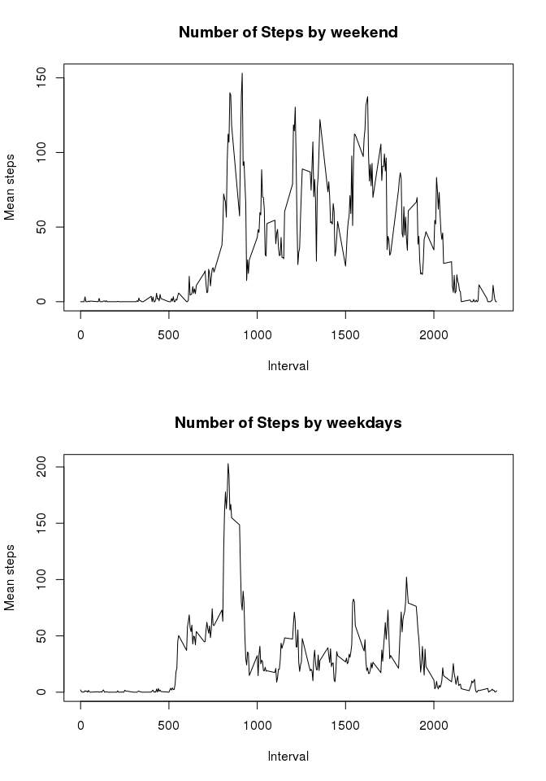

# Reproducible Research: Peer Assessment 1
### Basic settings

```r
echo = TRUE  # Always make code visible
```

## Loading and preprocessing the data
### Load the data

```r
library(dplyr)
```

```
## 
## Attaching package: 'dplyr'
```

```
## The following object is masked from 'package:stats':
## 
##     filter
```

```
## The following objects are masked from 'package:base':
## 
##     intersect, setdiff, setequal, union
```

```r
library(ggplot2)
#Read dataset 
activity <- read.csv("~/activity.csv", stringsAsFactors=FALSE)
```
### Process/transform the data in suitable format

```r
# Creating a subset for comfort work with first part of task
activity1<-activity[,c(1,2)]
# Transform date to standard form
activity1$date<-as.Date(activity1$date,"%Y-%m-%d")
```

## What is mean total number of steps taken per day?
For this part of the assignment, you can ignore the missing values in the dataset.
### Calculate the total number of steps taken per day

```r
sums<-group_by(activity1,date)
sums<-summarise_each(sums,funs(sum))
names(sums) <- c("Date", "TotalStepsTaken")
```
### Make a histogram of the total number of steps taken each day

```r
hist(sums$TotalStepsTaken,ylab="Frequency",xlab="Total Number of Steps per Day", main="Total Number of Steps Taken Each Day", col="red")
```

\
### Calculate and report the mean and median of the total number of steps taken per day

```r
mean(sums$TotalStepsTaken,na.rm=TRUE)
```

```
## [1] 10766.19
```

```r
median(sums$TotalStepsTaken,na.rm=TRUE)
```

```
## [1] 10765
```

```r
rm(activity1)
rm(sums)
```

## What is the average daily activity pattern?
### Make a time series plot

```r
averages<-aggregate(steps ~ interval, activity, FUN="mean")
plot(averages$interval, averages$steps, type="l", ylab="Average Number of Steps Taken Across All Days", xlab="5-Minute Interval", main="Average Number of Steps Taken Across All Days per Interval")
```

\
### Which 5-minute interval, on average across all the days in the dataset, contains the maximum number of steps?

```r
averages[which.max(averages$steps),]
```

```
##     interval    steps
## 104      835 206.1698
```
### Imputing missing values
* The total number of rows with NAs:

```r
sum(is.na(activity$steps))
```

```
## [1] 2304
```
* Devise a strategy for filling in all of the missing values in the dataset. The strategy does not need to be sophisticated. For example, you could use the mean/median for that day, or the mean for that 5-minute interval, etc.
* Create a new dataset that is equal to the original dataset but with the missing data filled in.

```r
# Missing values mean that people did not use activity tracker or it might be broken or there was no battery energy. So that we can set the missing values to 0.
activitywithimput<-activity
for(i in 1:nrow(activitywithimput))
{
  if(is.na(activitywithimput$steps[i]))
  {
    activitywithimput$steps[i]<-0
  }
}
```
* Make a histogram of the total number of steps taken each day and Calculate and report the mean and median total number of steps taken per day. 

```r
sums<-aggregate(steps ~ date, activitywithimput, sum)
names(sums) <- c("Date", "TotalStepsTaken")
hist(sums$TotalStepsTaken,ylab="Frequency",xlab="Total Number of Steps per Day", main="Total Number of Steps Taken Each Day", col="green")
```

\
* Do these values differ from the estimates from the first part of the assignment? What is the impact of imputing missing data on the estimates of the total daily number of steps?

```r
mean(sums$TotalStepsTaken)
```

```
## [1] 9354.23
```

```r
median(sums$TotalStepsTaken)
```

```
## [1] 10395
```
After imputing missing values new mean and median are less than old mean and median
### Are there differences in activity patterns between weekdays and weekends?
* Make a panel plot containing a time series plot (i.e. type = "l") of the 5-minute interval (x-axis) and the average number of steps taken, averaged across all weekday days or weekend days (y-axis).

```r
activitywithimput$day<-weekdays(as.Date(activitywithimput$date))
for (i in 1:nrow(activitywithimput))
{
  if(activitywithimput$day[i]=="Sunday"|activitywithimput$day[i]=="Saturday")
  {
    activitywithimput$day[i]<-"weekend"
  }
  else
  {
    activitywithimput$day[i]<-"weekday"
  }
}
activitywithimput$day<-as.factor(activitywithimput$day)
df1<-activitywithimput[which(activitywithimput$day=="weekend"),]
df2<-activitywithimput[which(activitywithimput$day=="weekday"),]
df11<-aggregate(steps~interval,df1,FUN = "mean")
df22<-aggregate(steps~interval,df2,FUN = "mean")
par(mfrow=c(2,1))
plot(df11$interval, df11$steps, type="l", ylab="Mean steps", xlab="Interval", main="Number of Steps by weekend")
plot(df22$interval, df22$steps, type="l", ylab="Mean steps", xlab="Interval", main="Number of Steps by weekdays")
```

\
